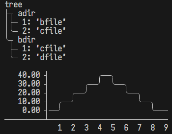

# AsciiTable



## install
```
pesde add kimpure/asciitable
```

## using

import
```luau
local asciitable = require(path)
```

table
```luau
print(asciitable.table(table))
```

tree
```luau
print(asciitable.tree(string, table))
```

round
```luau
asciitable.round = true
```


